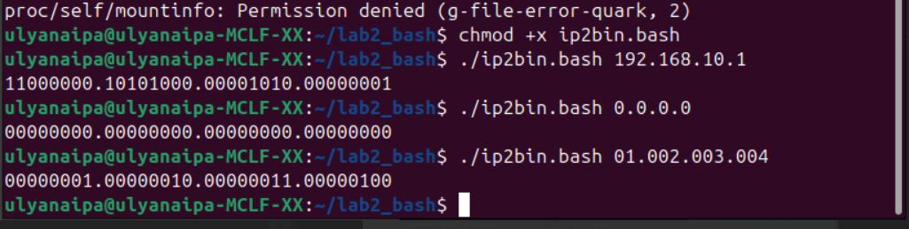

# Лабораторная работа 2
## Тема: Преобразование IPv4-адреса в двоичный формат (скрипт)
## Постановка задачи
Написать скрипт на Bash, который:
- принимает на вход IPv4-адрес в десятичном виде (например, `192.168.10.1`)
- выводит этот IP-адрес в двоичном формате
## Пример:
Ввод:
`192.168.10.1`
Вывод:
`11000000.10101000.00001010.00000001`

## Теория 
IPv4-адрес - это 32-битное число, обычно записываемое как 4 числа через точку: A.B.C.D, где каждое число в диапазоне 0..255.
Каждая комбинация (4 числа) это 8 бит, поэтому перевод IPv4 в двоичный вид делается так:
1. разбить строку по точкам на 4 числа
2. каждое число перевести в двоичный вид ровно из 8 бит
3. собрать обратно через точки

#### Аргументы командной строки в Bash
`$0` - имя запущенного скрипта, `$1`, `$2`, ... - аргументы, `$#` - количество аргументов
#### Проверка формата и диапазона
Формат d.d.d.d удобно сначала проверить регулярным выражением в [[ ... ]], но формата недостаточно, так как надо ещё убедиться, что:
1. комбинаций разделенных точкой ровно 4
2. каждый октет состоит только из цифр
3. значение каждого октета в диапазоне 0..255

## Ход работы 
1. Переход в папку лабораторной, создание файла скрипта и редактирование файла

2. Написание скрипта 


в начале скрипта написан shebang-комментарий, указывающий, с каким интерпретатором нужно выполнять скрипт. (мы используем bash)

далее идёт `if [[ $# -lt 1 ]]; then` - проверка количества аргументов: если меньше 1, значит пользователь не передал IP
(в целом что делает этот блок: если аргументов нет, то печатается подсказка, как пользоваться скриптом, exit 1 завершает работу с кодом ошибки)

скрип берет первый аргумент `ip="$1"` после имени скрипта (как раз таки наш айпи)

далее идёт проверка формата `[[ $ip =~ ^([0-9]{1,3}\.){3}[0-9]{1,3}$ ]]` с использованием регулярного выражения (если кратко: есть 4 группы цифр, между ними 3 точки, каждая группа длиной 1–3 цифры)

далее разбиваем IP на части `IFS='.' read -r -a octets <<< "$ip"`
octets станет массивом из чисел которые были разделены точками

(строчка 18) на всякий случай доп проверка что ровно 4 части

далее идёт цикл `for oct in "${octets[@]}"; do` мы проверяем каждую группу на то что это именно числа, далее `val=$((10#$oct))` - берем группу и превращаем её в обычное число, строго как в десятичной системе и потом проверям на диапазон (допустим у нас 01 и скрипт читает его как 1)

наконец основной цикл который не влез на скрин 
```
result=""
for i in "${!octets[@]}"; do
  val=$((10#${octets[i]}))
  bin=""

  for mask in "${masks[@]}"; do
    if (( val & mask )); then
      bin+="1"
    else
      bin+="0"
    fi
  done

  if (( i < 3 )); then
    result+="${bin}."
  else
    result+="${bin}"
  fi
done
echo "$result"
```
**логика такая**: у нас будет строка которая будет собирать результат.
У нас есть массив octets, в котором лежат 4 части IP-адреса.
Внешний цикл проходит по индексам этого массива и внутри каждой итерации берёт текущую группу, переводит её в число, и готовит пустую строку bin, куда будет собирать двоичную запись этой группы. 

Внутренний цикл: есть массив `masks=(128 64 32 16 8 4 2 1)` - это веса битов для 8-битного числа. Внутренний цикл проходит по этим маскам, на каждой маске проверяет, включён ли соответствующий бит у нашего числа (если бит есть добавляем к строке bin 1, а если нет то 0). После того как мы прошли все 8 масок, строка bin становится длиной ровно 8 символов и содержит двоичный код группы. После получения bin мы добавляем его в общий результат result. 

3. Выдаю права на выполнение и проверяю что всё работает 



